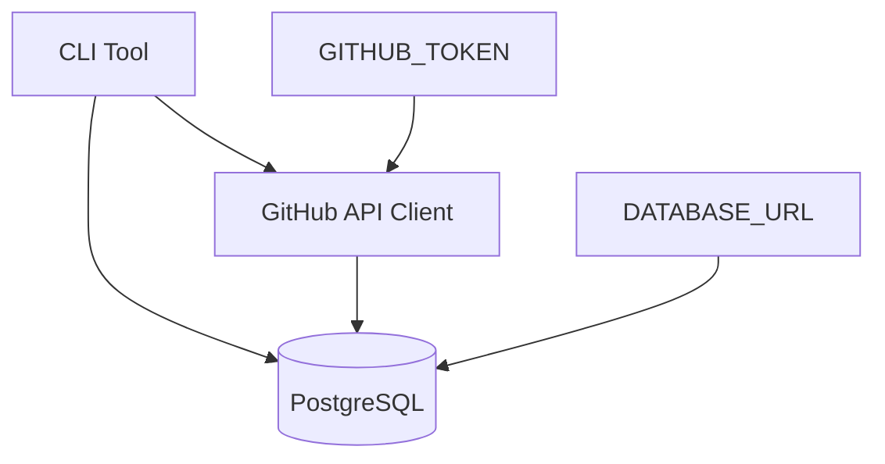

# Design Document

## Overview

Simple CLI tool that executes GitHub API search queries and stores results in PostgreSQL.

## Architecture



## Components and Interfaces

### GitHub API Client
- Execute any valid GitHub repository search query
- Handle authentication and rate limiting
- Return structured repository data

### Database Manager  
- Create timestamped tables (repos_YYYYMMDDHHMMSS)
- Store repository metadata
- Track query history

### CLI Interface
- Accept GitHub search query as argument
- Display progress and results
- Handle errors with clear messages

## Data Models

### Repository Table Schema
```sql
CREATE TABLE repos_YYYYMMDDHHMMSS (
    id SERIAL PRIMARY KEY,
    github_id BIGINT UNIQUE NOT NULL,
    full_name VARCHAR(255) NOT NULL,
    description TEXT,
    stars INTEGER NOT NULL,
    forks INTEGER NOT NULL,
    size_kb INTEGER,
    language VARCHAR(100),
    html_url VARCHAR(500) NOT NULL,
    created_at TIMESTAMP NOT NULL,
    updated_at TIMESTAMP NOT NULL,
    fetched_at TIMESTAMP DEFAULT NOW()
);
```

### Query History Schema
```sql
CREATE TABLE IF NOT EXISTS query_history (
    id SERIAL PRIMARY KEY,
    table_name VARCHAR(50) NOT NULL,
    search_query TEXT NOT NULL,
    result_count INTEGER NOT NULL,
    executed_at TIMESTAMP DEFAULT NOW()
);
```

## Error Handling

- Invalid search queries: GitHub API validation
- Rate limits: Exponential backoff retry
- Database errors: Connection and SQL error handling
- Missing environment variables: Clear setup instructions

## Testing Strategy

- Unit tests for GitHub API client with mock responses
- Database integration tests with test containers
- CLI argument parsing and error handling tests
- End-to-end workflow validation