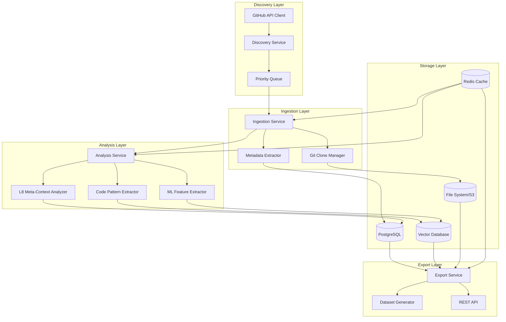

# Design Document20250927162247

## Overview

The GitHub Repository Database system is designed as a high-performance, scalable platform for systematic ingestion and analysis of open-source codebases. The architecture follows a modular, event-driven design that can efficiently process hundreds of repositories while extracting insights according to the L1-L8 hierarchy for the Knowledge Arbitrage project.

The system consists of four main subsystems: Repository Discovery & Ingestion, Code Analysis & Pattern Extraction, Data Storage & Management, and Export & Dataset Generation. Each subsystem is designed for independent scaling and can be deployed across multiple machines or cloud instances.

## Architecture



## Components and Interfaces

### Discovery Service
**Purpose:** Systematically discover and prioritize repositories for analysis

**Key Components:**
- **GitHub API Client:** Rate-limited client with intelligent backoff and token rotation
- **Repository Scorer:** Configurable scoring algorithm based on stars, activity, language composition, and domain relevance
- **Category Classifier:** ML-based classifier to assign repositories to Knowledge Arbitrage categories (OS Kernels, Databases, etc.)

**Interfaces:**
```rust
trait RepositoryDiscovery {
    async fn discover_by_criteria(&self, criteria: SearchCriteria) -> Result<Vec<Repository>>;
    async fn score_repository(&self, repo: &Repository) -> f64;
    async fn classify_repository(&self, repo: &Repository) -> Vec<Category>;
}
```

### Ingestion Service
**Purpose:** Clone repositories and extract comprehensive metadata

**Key Components:**
- **Git Clone Manager:** Sandboxed git operations with shallow/deep clone strategies
- **Metadata Extractor:** Parallel extraction of issues, PRs, commits, and contributor data
- **Content Analyzer:** File type detection, language analysis, and initial code metrics

**Interfaces:**
```rust
trait RepositoryIngestion {
    async fn ingest_repository(&self, repo: Repository) -> Result<IngestionResult>;
    async fn extract_git_history(&self, repo_path: &Path) -> Result<GitHistory>;
    async fn extract_github_metadata(&self, repo: &Repository) -> Result<GitHubMetadata>;
}
```

### Analysis Service
**Purpose:** Extract patterns and insights according to L1-L8 hierarchy

**Key Components:**
- **Code Pattern Extractor:** AST-based analysis for identifying optimization patterns, concurrency models, and architectural decisions
- **L8 Meta-Context Analyzer:** NLP analysis of commit messages, issues, and PRs to extract decision rationale
- **Cross-Repository Pattern Matcher:** Identifies similar patterns across different codebases

**Interfaces:**
```rust
trait CodeAnalysis {
    async fn extract_patterns(&self, repo: &AnalyzedRepository) -> Result<Vec<CodePattern>>;
    async fn analyze_meta_context(&self, repo: &AnalyzedRepository) -> Result<MetaContext>;
    async fn find_cross_repo_patterns(&self, patterns: &[CodePattern]) -> Result<Vec<PatternCluster>>;
}
```

### Export Service
**Purpose:** Generate structured datasets for LLM training

**Key Components:**
- **Dataset Generator:** Configurable export formats optimized for different LLM architectures
- **Attribution Manager:** Tracks licensing and attribution requirements
- **Quality Validator:** Ensures dataset completeness and quality

**Interfaces:**
```rust
trait DatasetExport {
    async fn generate_dataset(&self, config: ExportConfig) -> Result<Dataset>;
    async fn validate_dataset(&self, dataset: &Dataset) -> Result<ValidationReport>;
    async fn export_format(&self, dataset: &Dataset, format: ExportFormat) -> Result<Vec<u8>>;
}
```

## Data Models

### Core Repository Model
```rust
#[derive(Debug, Clone, Serialize, Deserialize)]
pub struct Repository {
    pub id: Uuid,
    pub github_id: i64,
    pub full_name: String,
    pub url: String,
    pub clone_url: String,
    pub language: Option<String>,
    pub languages: HashMap<String, i64>,
    pub stars: i32,
    pub forks: i32,
    pub size: i64,
    pub created_at: DateTime<Utc>,
    pub updated_at: DateTime<Utc>,
    pub pushed_at: DateTime<Utc>,
    pub categories: Vec<Category>,
    pub priority_score: f64,
    pub status: IngestionStatus,
}

#[derive(Debug, Clone, Serialize, Deserialize)]
pub enum IngestionStatus {
    Discovered,
    Queued,
    Ingesting,
    Analyzing,
    Complete,
    Failed(String),
}
```

### Code Pattern Model
```rust
#[derive(Debug, Clone, Serialize, Deserialize)]
pub struct CodePattern {
    pub id: Uuid,
    pub repository_id: Uuid,
    pub pattern_type: PatternType,
    pub hierarchy_level: HierarchyLevel, // L1-L8
    pub file_path: String,
    pub line_range: (usize, usize),
    pub code_snippet: String,
    pub description: String,
    pub metrics: PatternMetrics,
    pub related_issues: Vec<String>,
    pub embedding: Option<Vec<f32>>,
}

#[derive(Debug, Clone, Serialize, Deserialize)]
pub enum HierarchyLevel {
    L1IdiomaticPatterns,
    L2DesignPatterns,
    L3MicroLibraries,
    L4MacroLibraries,
    L5Architecture,
    L6DomainSpecific,
    L7LanguageCapability,
    L8MetaContext,
}
```

### Meta-Context Model
```rust
#[derive(Debug, Clone, Serialize, Deserialize)]
pub struct MetaContext {
    pub id: Uuid,
    pub repository_id: Uuid,
    pub decision_point: String,
    pub rationale: String,
    pub alternatives_considered: Vec<String>,
    pub constraints: Vec<String>,
    pub trade_offs: Vec<TradeOff>,
    pub related_commits: Vec<String>,
    pub related_issues: Vec<String>,
    pub confidence_score: f64,
}
```

## Error Handling

### Resilience Strategy
The system implements a multi-layered error handling approach:

1. **Circuit Breaker Pattern:** For external API calls (GitHub API, Git operations)
2. **Retry with Exponential Backoff:** For transient failures
3. **Dead Letter Queue:** For failed ingestion jobs that require manual intervention
4. **Graceful Degradation:** Continue processing other repositories when one fails

### Error Categories
```rust
#[derive(Debug, thiserror::Error)]
pub enum SystemError {
    #[error("GitHub API rate limit exceeded: {retry_after}")]
    RateLimitExceeded { retry_after: Duration },
    
    #[error("Repository clone failed: {repo_url} - {source}")]
    CloneFailed { repo_url: String, source: git2::Error },
    
    #[error("Analysis timeout: {repo_id} - exceeded {timeout:?}")]
    AnalysisTimeout { repo_id: Uuid, timeout: Duration },
    
    #[error("Storage error: {operation} - {source}")]
    StorageError { operation: String, source: sqlx::Error },
    
    #[error("Security violation: {repo_id} - {reason}")]
    SecurityViolation { repo_id: Uuid, reason: String },
}
```

## Testing Strategy

### Unit Testing
- **Repository Discovery:** Mock GitHub API responses, test scoring algorithms
- **Code Analysis:** Test pattern extraction on known code samples
- **Data Models:** Serialization/deserialization, validation logic
- **Error Handling:** Simulate various failure scenarios

### Integration Testing
- **End-to-End Ingestion:** Test complete pipeline with small test repositories
- **Database Operations:** Test complex queries and data integrity
- **API Integration:** Test GitHub API integration with rate limiting

### Performance Testing
- **Concurrent Ingestion:** Test parallel processing of multiple repositories
- **Large Repository Handling:** Test with repositories like Linux kernel
- **Memory Usage:** Profile memory consumption during analysis
- **Storage Scalability:** Test database performance with large datasets

### Security Testing
- **Sandboxing:** Verify malicious repositories cannot escape sandbox
- **Input Validation:** Test with malformed repository data
- **Access Control:** Verify proper authentication and authorization

## Deployment Architecture

### Local Development
```yaml
services:
  postgres:
    image: postgres:15
    environment:
      POSTGRES_DB: repo_db
      
  redis:
    image: redis:7-alpine
    
  qdrant:
    image: qdrant/qdrant:latest
    
  app:
    build: .
    depends_on: [postgres, redis, qdrant]
```

### Production Scaling
- **Horizontal Scaling:** Multiple ingestion and analysis workers
- **Database Sharding:** Partition repositories by category or size
- **Caching Strategy:** Redis for frequently accessed metadata
- **Storage Tiering:** Hot data in SSD, cold data in object storage

### Monitoring and Observability
- **Metrics:** Prometheus for system metrics, custom metrics for ingestion rates
- **Logging:** Structured logging with correlation IDs
- **Tracing:** Distributed tracing for complex analysis pipelines
- **Alerting:** Alerts for failed ingestions, rate limit violations, storage issues